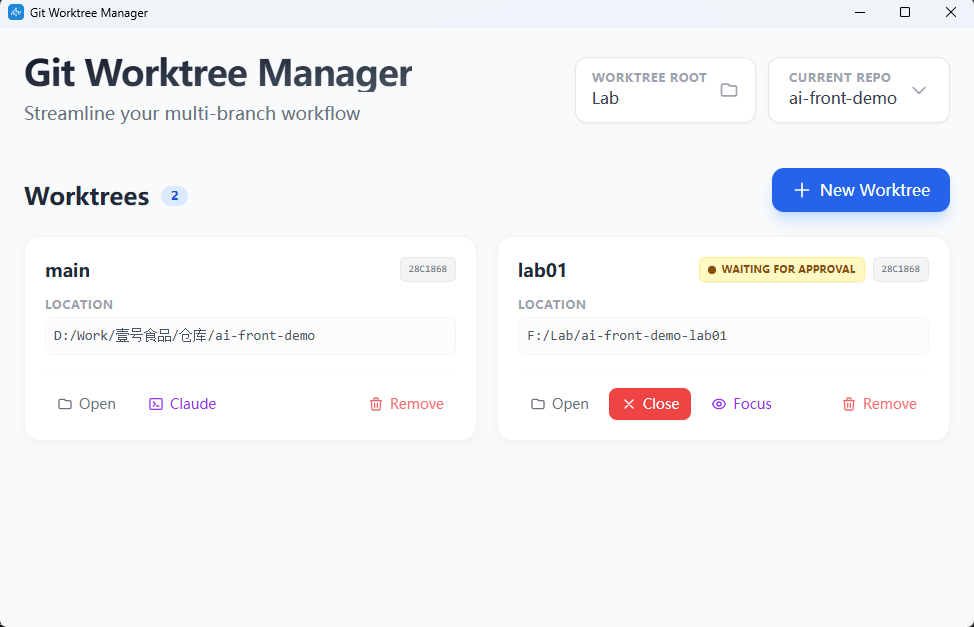
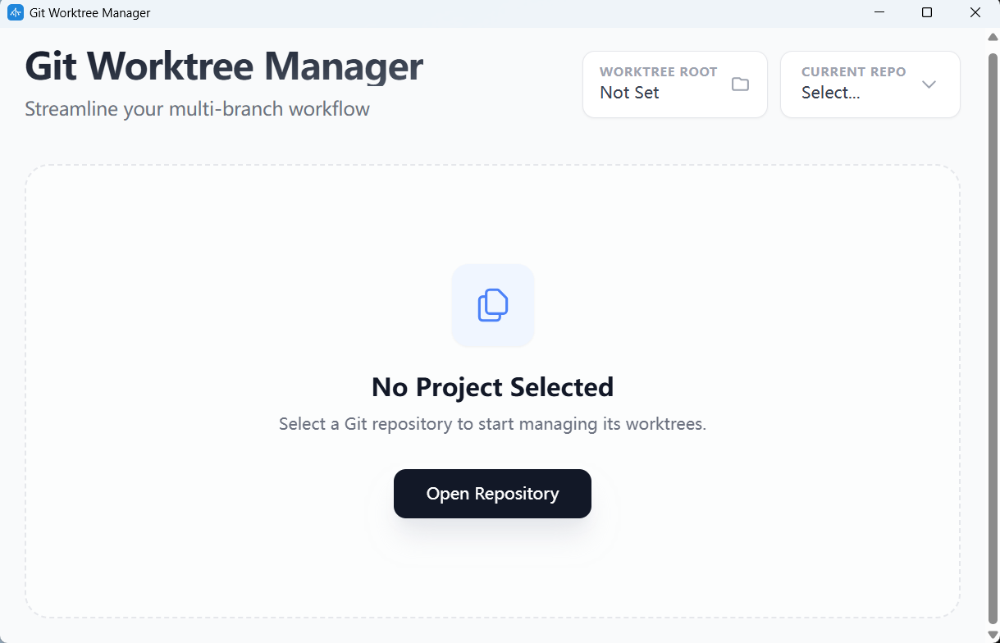

# Git Worktree Manager

<div align="center">



**基于 Tauri + Vue 3 的现代化 Git Worktree 管理工具**  
*告别繁琐的 `git stash`，拥抱并行的多分支开发工作流*

[English Version](./README_EN.md)

</div>

## 📖 为什么开发这个工具？

**核心痛点：如何优雅地让多个 AI Agent (Claude Code) 同时为一个项目工作？**

随着 AI 辅助编程的普及，我们经常需要让多个 Claude Code 实例并行处理不同的任务（例如：Agent A 修 Bug，Agent B 写新功能，Agent C 做重构）。但如果让它们都在同一个项目目录下操作：
- **文件冲突**：多个 AI 同时修改文件，导致相互覆盖或 Git 锁死。
- **上下文污染**：Agent A 读取到了 Agent B 改了一半的代码，产生幻觉或逻辑错误。
- **环境打架**：多个进程争抢编译锁或端口。

**Git Worktree 是这个场景下的“物理隔离舱”。** 它允许我们从同一个仓库中检出多个**独立的文件系统工作区**。

**Git Worktree Manager 的本质，是一个面向多 Agent 协作的编排管理终端。**
它不仅仅是管理 Git 分支，更是为了**物理隔离**多个 AI 的工作环境。你可以轻松为每个任务创建一个“沙箱”，让 Claude 在里面大展拳脚而不因为文件冲突“打架”。把它想象成你的 **AI 工程师团队的工位管理器**。

## ✨ 核心功能

### 🌳 可视化工作区管理
- 一览无余地查看当前仓库关联的所有 Worktree。
- 直观展示分支名称、Commit Hash 和路径信息。
- 自动识别并管理“野生”的 Worktree。
- **便捷访问**：一键打开工作区文件夹或启动独立终端窗口。

### ⚡ 极速创建与销毁
- **一键创建**：只需输入新分支名（如 `feat/login`），自动创建同级目录。
- **安全清理**：开发完成后，点击 Remove 即可连同分支和文件夹一起安全删除，保持磁盘整洁。

### 🤖 Claude Code 深度集成 (New!)
专为 AI 辅助编程打造的深度集成体验：
- **内嵌终端**：直接在对应的 Worktree 目录下启动 Claude Code。
- **由 AI 驱动的状态感知**：卡片实时显示 Claude 的工作状态：
    - 🟡 **Waiting for Approval**: 当 Claude请求权限时，卡片高亮并发送系统通知。
    - 🔵 **Working**: AI 正在思考或执行任务。
    - 🟢 **Idle**: 任务完成，随时待命。
- **自动配置**：开箱即用，自动配置 Claude Hooks，无需手动折腾脚本。

### 🔗 智能依赖同步 (New!)
针对 Vben Admin 等大型 Monorepo 项目特制：
- **递归识别**：自动读取主仓库 `.gitignore`，递归扫描并链接所有被忽略的目录（如 `apps/*/node_modules`, `.env`, `target`）。
- **空间零占用**：默认使用 Junction/Symlink 软链接技术，新 Worktree 秒级生成且不占额外磁盘空间。
- **按需开启 (New)**：在创建弹窗中提供可选开关（默认关闭），您可以根据需求灵活决定是否链接 `node_modules`。
- **权限自动批处理**：如果遇到权限问题（如 Windows 不允许普通用户创建链接），会自动收集所有请求，**只弹出一个 UAC 确认框**即可全部搞定。

## ⚠️ 注意事项

- **仅限 Windows 系统**：目前该工具的核心逻辑（如 `mklink` 软链接和 `RunAs` 管理员权限提升）深度依赖 Windows 系统机制，暂不支持 macOS 或 Linux。
- **尽量不要跨盘符创建 Worktree**：虽然工具内置了“软链失败自动降级为复制”的策略，但跨盘符会导致无法使用硬链接/Junction，所有巨大的 `node_modules` 都会被物理复制一份，速度慢且占用双倍空间。**建议将根目录设置在与主仓库相同的磁盘分区下。**

## 📷 软件截图

| 主界面仪表盘 | Claude 智能集成 |
|:---:|:---:|
|  |  |

> *界面展示了清爽的卡片式布局以及与 Claude Code 联动时的状态变化*

## 🛠️ 技术栈

- **Core**: [Tauri 2.0](https://tauri.app/) (Rust) - 极致轻量与安全
- **Frontend**: Vue 3 + TypeScript + TailwindCSS - 顺滑的交互体验
- **AI Integration**: Rust Axum Server + PowerShell Hooks

## 🚀 快速开始

### 1. 安装依赖
```bash
npm install
```

### 2. 开发模式运行
```bash
npm run tauri dev
```
*提示：如果是 Windows 系统，首次启动会自动安装 Claude Hooks 脚本到您的用户目录。*

### 3. 构建生产包
```bash
npm run tauri build
```

## 📝 使用指南

1.  **选择仓库**：点击右上角选择你的 Git 主仓库目录。
2.  **设置根目录**：选择一个文件夹作为所有新 Worktree 的存放跟目录（建议选在主仓库的上级目录）。
3.  **新建工作区**：点击 "New Worktree"，输入分支名，即刻开始并行开发。
4.  **调用 Claude**：点击卡片上的 "Claude" 按钮，唤起 AI 助手，它会自动进入该目录为你写代码。
5.  **打开终端**：点击 "Terminal" 按钮，直接在当前目录启动 PowerShell 窗口进行手动操作。
